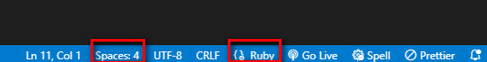
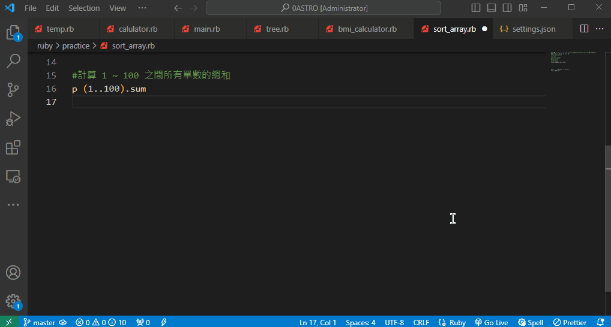
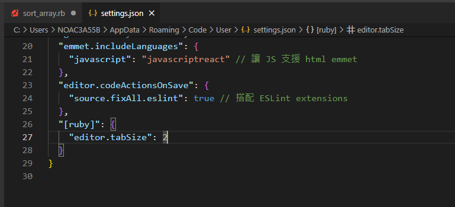
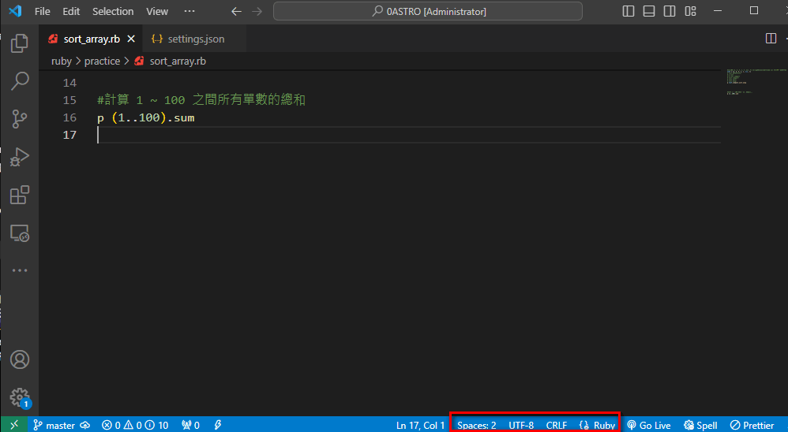

Ruby編寫是使用2格空白來做為縮排
但是VS Code 一般預設Tab縮排的寬度是4格
查詢了一下找到了設定的方法
 
目前的設定顯示縮排寬度是4格


接下來點「Ruby」彈出設定，選擇「Configure 'Ruby' language based settings...」


這樣就會切換到User Settings的畫面並且出現```"[ruby]":{}```
在區塊中的```{}```內加上```"editor.tabSize":2```就可以了


修改完記得要儲存才會生效唷
接著找個Ruby的檔案查看下方Spaces的設定就會是2了


